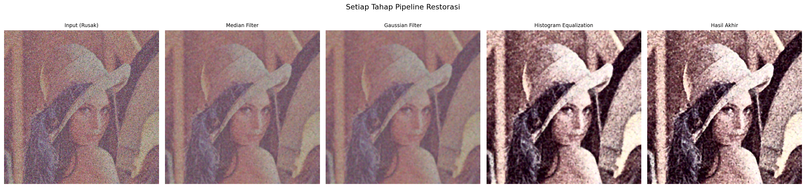

# Mini Project 1 — Image Restoration

**Mata Kuliah:** Pengolahan Citra dan Video  
**Nama:** Muhammad Syaiful Kalam  
**NRP:** 5024241093

---

## Deskripsi Singkat

Proyek ini untuk membetulkan gambar dari lena yang sudah diberikan menjadi gambar yang bisa dikenalia atau menjadi gambar yang lebih baik dibandingkan sebelumnya. Gambar tersebut terdapat beberapa kerusakan diantaranya:

Low contrast: Gambarnya kusam dan gelap karena range warnanya terlalu sempit.

Gaussian noise: Terdapat noise halus yang mengakibatkan tekstur gambar jadi berpasir.

Salt-and-pepper noise: Terdapat bintik hitam dan putih pada gambar.

Blur: Gambar menjadi kurang fokus dan detailnya hilang.

---

## Struktur Folder

```
mp1-image-restoration/
├── Projecttesting123.py   # File program utama
├── README.md              # Penjelasan proyek ini
├── input/
│   └── lena_noisy.png     # Citra input yang sudah rusak
└── output/
    ├── lena_restored.png  # Citra hasil restorasi
    ├── comparison.png     # Perbandingan sebelum vs sesudah
    └── pipeline_steps.png # Visualisasi setiap tahap
```

---

## Alur Pengerjaan
### Step 1 — Median Filter (Menghilangkan Salt-and-Pepper Noise)

Median filter bekerja dengan cara mengurutkan nilai piksel dan mengambil nilai tengahnya. Teknik ini digunakan pada gambar dengan salt-and-pepper noise (bercak titik hitam dan putih yang ekstrem), di mana nilai piksel yang rusak biasanya berada di angka 0 (hitam pekat) atau 255 (putih murni). Karena filter ini hanya mencari nilai tengah, nilai-nilai ekstrem tersebut otomatis terbuang ke ujung urutan dan tidak akan pernah terpilih, sehingga noise hilang tanpa membuat bentuk objek menjadi terlalu blur.

---

### Step 2 — Gaussian Filter (Mengurangi Gaussian Noise)
Gaussian filter bekerja dengan meratakan (blur) piksel berdasarkan bobot jarak menggunakan kurva berbentuk lonceng (distribusi normal). Filter ini digunakan karena setelah proses median filter biasanya masih tersisa Gaussian noise yang membuat tekstur gambar berbintik kasar. Berbeda dengan blur biasa yang memukul rata piksel dan menghilangkan detail, Gaussian filter lebih pintar dengan memberi bobot besar pada piksel di dekat titik pusat dan bobot kecil untuk piksel yang jauh, sehingga gambar menjadi halus namun strukturnya tetap terjaga.

---

### Step 3 — Histogram Equalization (Memperbaiki Kontras Rendah)

Histogram Equalization bekerja dengan meregangkan distribusi intensitas cahaya pada gambar agar mengisi penuh rentang warna dari ujung gelap hingga ujung terang. Teknik ini digunakan untuk memperbaiki gambar dengan kontras rendah yang terlihat kusam karena nilai pikselnya menumpuk di area tengah saja. Dengan menyebarkan nilai piksel dari rentang 0 hingga 255 secara khusus pada channel Y (luminance/kecerahan), gambar otomatis memiliki kontras yang lebih kuat dan hidup tanpa merusak tampilan warnanya.

---

### Step 4 — Unsharp Masking (Mempertajam Detail yang Blur)

Unsharp Masking bekerja dengan mengekstrak detail garis tepi (edges) dari gambar, lalu menambahkannya kembali ke gambar aslinya untuk mempertegas objek. Teknik ini sangat dibutuhkan karena gambar biasanya sedikit kehilangan ketajamannya setelah melewati proses filter smoothing di langkah sebelumnya. Dengan mengaplikasikan metode ini, ketajaman gambar yang memudar dapat dikembalikan sehingga batas-batas objek terlihat lebih jelas dan tegas.

---

## Perbandingan Visual

### Sebelum hingga sesudah dan tahapannya



---

## Cara Menjalankan

### 1. Install library yang dibutuhkan

```bash
pip install numpy opencv-python matplotlib, opencv-contrib-python, numpy
```

### 2. Pastikan struktur folder sudah benar

```
mp1-image-restoration/
├── Projecttesting123.py
├── input/
│   └── lena_noisy.png   
└── output/               
```

### 3. Jalankan program

```bash
python Projecttesting123.py
```

### 4. Cek hasil di folder `output/`

---
